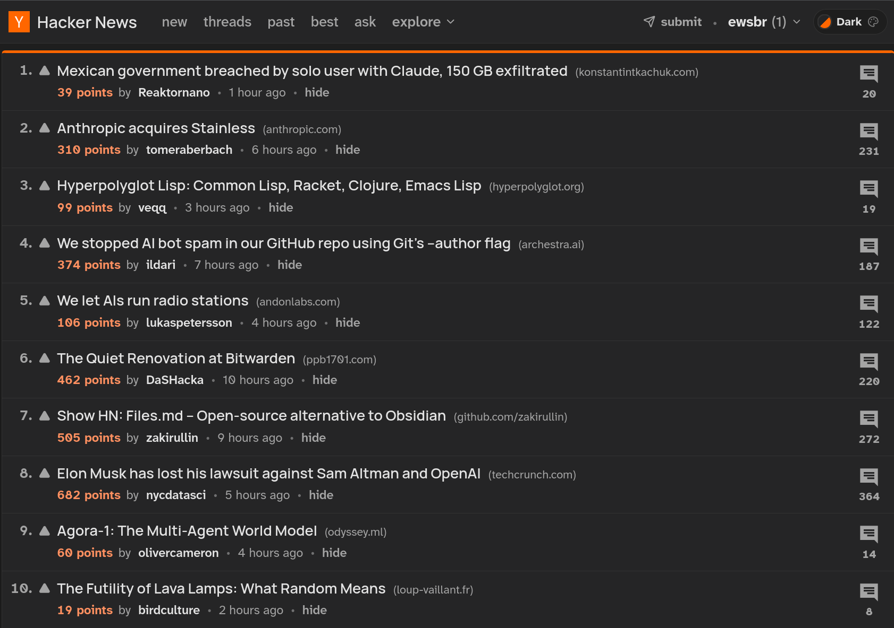

<div align='center'>


<h1>Fancy Hacker News</h1>

<p><strong>A fancy redesign of Hacker News with theme support.</strong></p>

</div>

A Chrome and Firefox extension that fully parses and re-renders Hacker News pages with Vue 3.

There is no SPA routing, and the redesigned UI keeps Hacker News behavior native: links and forms still point at HN, voting and flagging use HN's own endpoints, and search opens Algolia in a new tab.



<p align="center">
    <a href="https://addons.mozilla.org/en-US/firefox/addon/fancy-hacker-news/">
        
    </a>
    &nbsp;
    <a href="https://chromewebstore.google.com/detail/ofhiglbjpjpdodndhoblgnjgkakhfofi/preview?authuser=0">
        
    </a>
</p>

## Goals
> Hacker News, but like it was designed after 2020.

The objective is to provide a more pleasant Hacker News experience with many QoL improvements and full feature parity. **If you know of a feature that doesn't work with the extension, please open an issue.**

Some features, like downvote levels, upvoting and flagging are not available via API, so we just pay the price of parsing HTML from the actual page.

> Why not customize via CSS?

CSS-only customization is very limited. We cannot rearrange elements, add HN-only features (like the downvote level counters) or fix some structural issues, such as the "everything is a table" HTML.

**Non-goals**:
- SPA routing. Yes, we will re-render the page on every navigation.
- Custom backend or proxying.

## Commands

Build:

- `pnpm build` — production build for the shared Firefox/Chromium content script and anti-FOUC bootstrap.

Package:

- `pnpm package` — run quality checks, build once, and create both the AMO-ready Firefox ZIP and the Chrome Web Store-ready ZIP in `web-ext-artifacts/`.

Develop and verify:

- `pnpm dev` — watch mode for the content script.
- `pnpm check` — run lint, typecheck, tests, and the production build.
- `pnpm lint` — run ESLint.
- `pnpm typecheck` — run `vue-tsc --noEmit`.
- `pnpm test` — run Vitest once.
- `pnpm test:watch` — run Vitest in watch mode.

Design concepts playground:

- `pnpm concepts:dev` — run the concepts dev server.
- `pnpm concepts:build` — build the concepts playground.
- `pnpm concepts:preview` — preview the built concepts playground.

## Build Output

Production builds write extension assets to `dist/`. Package commands write browser-store ZIPs to `web-ext-artifacts/`.

## Deferred Comment Sources

On extreme item pages, [the item parser](src/parsers/item.ts) captures original comment rows for deferred threads without modifying the source DOM. [Item page state](src/state/item-page-state.ts) manages their lifetime:

- Detach pending rows individually only after successful mounting and source-body cleanup. A shared source parent would retain other threads.
- Keep rows outside Vue reactivity. Parse them directly when the user loads a thread, then replace them with a cached raw comment model.
- Keep rows on parse failure so loading can be retried. Reuse the cached model on component remount.

This avoids serializing and reparsing deferred HTML, but retains more DOM memory while threads remain unopened. Source rows must never be detached during initial parsing: a failed mount must leave the original page recoverable.

## Testing

Tests run with Vitest in two lanes:

- `node` is the default environment for route resolution, parsers, and pure content logic.
- `jsdom` is opt-in for Vue SFC tests and specs that need browser globals like `document`, `window`, or `KeyboardEvent`. Use `// @vitest-environment jsdom` at the top of those files.

HTML snapshots of real Hacker News pages live in `test/fixtures/`. Fixture and parser tests should load documents through the shared helpers in `test/helpers/` instead of creating global browser state for the whole suite.

- `pnpm test` — run the full test suite once.
- `pnpm test:watch` — run the suite in watch mode.

## Releasing
To create a release, run `pnpm run package`. Then generate upload the release artifacts to GitHub manually.

Release notes are generated with [git-cliff](https://git-cliff.org/).
```bash
# Message for the changelog entry
git-cliff --unreleased --config cliff.toml

# Message for Firefox extension release notes
git-cliff --unreleased --config cliff.amo.toml
```

## Browser Support

| Browser | Minimum version |
|---------|----------------|
| Firefox | 140 (142 for Android) |
| Chrome / Chromium | 114 |
